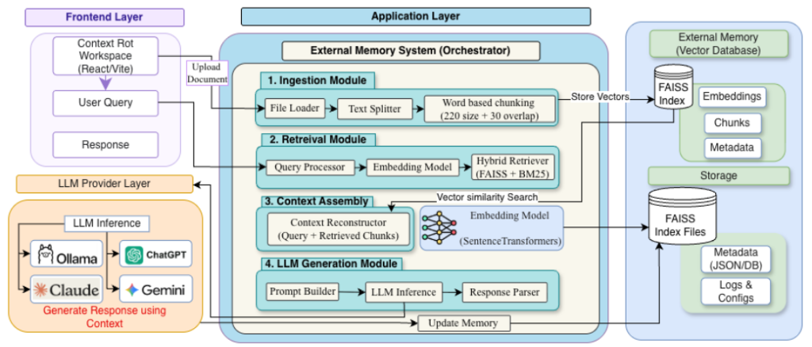

# Mitigating Hallucination and Context Degradation in LLMs

<div align="center">

[](https://www.python.org/)
[](https://fastapi.tiangolo.com/)
[](https://nextjs.org/)
[](https://github.com/facebookresearch/faiss)
[](https://github.com/dorianbrown/rank_bm25)
[](https://www.sbert.net/)
[](https://github.com/astral-sh/ruff)
[](https://github.com/Sanju562586/Mitigating-Context-Degradation/actions)
[](LICENSE)

**An End-to-End Grounded Retrieval-Augmented Generation (RAG) Architecture Featuring Hybrid Search, Extractive Context Compaction, Evidence Sufficiency Gating, Anti-Hallucination Guardrails, and Cross-Session External Vector Memory.**

[System Architecture](#-system-architecture) •
[Key Innovations](#-key-innovations--problem-formulation) •
[Subsystem Walkthrough](#-core-subsystems) •
[Quick Start](#-quick-start-guide) •
[API Reference](#-api-reference) •
[Browser Extension](#-browser-extension--client-sync) •
[Testing](#-testing--verification)

</div>

---

## 📌 Problem Formulation & Motivation

Large Language Models (LLMs) deployed for document-grounded question answering suffer from five fundamental structural failure modes:

1. **Context Degradation & The "Lost-in-the-Middle" Phenomenon:** LLMs attend disproportionately to information placed at the immediate beginning or end of long prompt contexts, often missing decisive evidence placed in the middle.
2. **Context Dilution & Redundancy Bloat:** Standard RAG pipelines retrieve overlapping, repetitive chunks that exhaust token allowances while introducing distracting semantic noise.
3. **Unchecked Generative Hallucination:** LLMs produce authoritative-sounding statements not substantiated by the provided reference text, frequently hallucinating fake citation tags.
4. **Failure to Abstain on Inadequate Information:** Models attempt to answer queries even when retrieved evidence is absent or insufficient, instead of triggering principled abstention.
5. **Cross-Session Context Amnesia:** Traditional systems lack long-term episodic memory, causing user intent, verified facts, and external web browsing insights to be lost between sessions.

This repository implements a **multi-stage evidence retrieval, context optimization, evidence sufficiency gating, NLI claim verification, and cross-session external memory architecture** designed to guarantee factual trustworthiness and mitigate context degradation.

---

## 🏛️ System Architecture

<p align="center">
  
</p>

The system architecture is structured into decoupled, high-performance layers centered around the **External Memory System (Orchestrator)**:

### 1. Frontend Layer
- **Context Rot Workspace (React/Vite / Next.js)**: Clean, intuitive workspace enabling document ingestion, query submission, and real-time response inspection.
- **Side-by-Side Comparison**: Concurrently compares responses from the **Naive LLM** (prompted directly with the entire monolithic document) versus **Our Application Pipeline** (grounded with hybrid retrieval, context compaction, and verified citations).
- **Upload Document & User Query**: Intuitive drag-and-drop file ingestion and natural language query interface.

### 2. Application Layer — External Memory System (Orchestrator)
- **1. Ingestion Module**:
  - `File Loader`: Multi-format parsers for PDF, DOCX, TXT, MD, and HTML.
  - `Text Splitter`: Structural normalization and boundary-aware decomposition.
  - `Word based chunking (220 size + 30 overlap)`: Strict sliding window chunking producing cohesive 220-word units with 30-word boundary overlaps to eliminate context seams.
  - `Store Vectors`: Automatically writes vectorized representations into the external FAISS index.
- **2. Retrieval Module**:
  - `Query Processor`: Intent classification, conversational rewriting, and metadata filter extraction.
  - `Embedding Model`: Dense semantic vector representations via `SentenceTransformers` (`all-MiniLM-L6-v2`).
  - `Hybrid Retriever (FAISS + BM25)`: Parallel dual-retrieval combining dense vector cosine similarity with sparse lexical BM25, arbitrated via Reciprocal Rank Fusion ($RRF$).
- **3. Context Assembly**:
  - `Context Reconstructor (Query + Retrieved Chunks)`: Cross-encoder reranking, salience sentence pruning, and Lost-in-the-Middle boundary reordering.
  - `Vector similarity Search`: Real-time proximity searches over the index corpus.
  - `SentenceTransformers`: Dynamic context scoring and semantic deduplication ($\tau \ge 0.85$).
- **4. LLM Generation Module**:
  - `Prompt Builder`: Synthesizes evidence-grounded prompt templates enforcing mandatory bracketed citations (`[Doc X, Chunk Y]`).
  - `LLM Inference`: Dispatches requests to the configured model in the LLM Provider Layer.
  - `Response Parser`: Parses generated assertions, extracts citations, and verifies claims via sentence-level NLI.
  - `Update Memory`: Writes verified episodic interactions and persistent summaries to long-term storage.

### 3. LLM Provider Layer
- **LLM Inference ("Generate Response using Context")**:
  - **Ollama**: Local, private on-device LLM execution (e.g., Llama 3.2, Mistral).
  - **ChatGPT**: OpenAI API models (`gpt-4o`, `gpt-4o-mini`).
  - **Claude**: Anthropic API models (`claude-3-5-sonnet`, `claude-3-haiku`).
  - **Gemini**: Google GenAI models (`gemini-1.5-pro`, `gemini-1.5-flash`).
  - **Offline Grounded Synthesizer**: High-speed, deterministic offline inference without external keys or network dependencies.

### 4. External Memory (Vector Database)
- **FAISS Index**:
  - `Embeddings`: L2-normalized dense embeddings for instant vector similarity lookup.
  - `Chunks`: Granular text chunks (220-word windows) mapped to citation tags.
  - `Metadata`: Provenance tracking including source titles, page numbers, heading paths, and offsets.

### 5. Storage Tier
- **FAISS Index Files**: Serialized binary index files (`index_corpus.faiss`, `memory.faiss`).
- **Metadata (JSON/DB)**: ACID-compliant SQLite (`memory.db`) with WAL mode tracking sessions, episodic turns, and document registry.
- **Logs & Configs**: Audit logs, guardrail telemetry, and system configuration files.

---

## 💡 Key Innovations

| Feature | Mechanism | Benefit |
| :--- | :--- | :--- |
| **Hybrid Retrieval & RRF** | FAISS Inner-Product Dense Search + BM25 Sparse Inverted Index merged via $RRF(d) = \sum \frac{1}{k + r_i(d)}$ | Overcomes semantic gap while capturing rare keywords, acronyms, and proper nouns without score distribution bias. |
| **Cross-Encoder Reranking** | Joint query-document token cross-attention with Sigmoid score calibration | Eliminates false-positive vector matches before context packaging. |
| **Salience Sentence Pruning** | Extractive sentence ranking against query representations | Filters out boilerplate, headers, and irrelevant sentences inside chunks. |
| **Semantic Deduplication** | Cosine similarity clustering ($\tau \ge 0.85$) across adjacent chunks | Eliminates repetitive statements that consume token budgets. |
| **Lost-in-the-Middle Reordering** | High-salience evidence positioned at prompt boundaries (head & tail) | Maximizes LLM attention weights at positions proven to have the highest retention. |
| **Evidence Sufficiency Gate** | Pre-flight metric evaluating semantic coverage & missing query aspects | Proactively abstains when evidence is insufficient, preventing hallucinations before generation. |
| **Anti-Hallucination NLI Guardrails** | Atomic proposition extraction + Natural Language Inference (NLI) classification | Classifies each claim as **Entailed**, **Neutral**, or **Contradicted** with citation provenance. |
| **Cross-Session External Memory** | ACID SQLite database + FAISS episodic vector index + Manifest V3 Browser Extension | Maintains cross-session context, stores verified facts, and injects web captures without bloating prompts. |

---

## 📦 Core Subsystems

### 1. Ingestion & Document Processing (`src/ingestion`, `src/cleaning`, `src/chunking`)
- **Parsers:** Multi-format extraction for `.pdf` (PyMuPDF), `.docx` (python-docx), `.txt`, `.md`, and `.html` (BeautifulSoup4).
- **Normalizer:** Whitespace canonicalization, control character filtering, and structural cleanup.
- **Chunking:** Overlapping sliding-window chunking preserving document ID, chunk ID, token counts, and parent heading context.

### 2. Dual Indexing Engine (`src/indexing`)
- **Dense Vector Store:** L2-normalized `sentence-transformers/all-MiniLM-L6-v2` embeddings indexed with FAISS `IndexFlatIP`.
- **Sparse BM25 Index:** Tokenized inverted index computing exact BM25 term frequencies with disk persistence.

### 3. Query Processing Engine (`src/query_processing`)
- **Intent Classifier:** Detects query types (`FACTUAL`, `EXPLORATORY`, `COMPARATIVE`, `INSTRUCTIONAL`).
- **Query Rewriter & Expander:** Generates semantically enriched variations to boost recall across heterogeneous vocabularies.
- **Filter Extractor:** Automatically parses structured metadata filters (dates, sources, categories) from natural language queries.

### 4. Hybrid Retrieval & RRF Fusion (`src/retrieval`)
- Executes parallel dense vector search and sparse keyword retrieval.
- Merges candidate ranks via **Reciprocal Rank Fusion (RRF)**:
  $$\text{RRF\_Score}(d) = \sum_{m \in \{\text{dense}, \text{sparse}\}} \frac{1}{k + \text{rank}_m(d)} \quad (k = 60)$$

### 5. Cross-Encoder Reranking & Score Pruning (`src/reranking`)
- Scores the top candidate passages using full cross-attention.
- Dynamically prunes passages falling below calibrated relevance thresholds.

### 6. Context Compaction & Optimization (`src/context`)
- **Sentence Pruner:** Extracts only high-salience propositions matching the user query.
- **Semantic Deduplicator:** Identifies and strips redundant sentences across retrieved chunks.
- **Lost-in-the-Middle Reorderer:** Solves attention degradation by ordering evidence chunks:
  $$\text{Position Order: } [E_1, E_3, E_5, \dots, E_6, E_4, E_2]$$
- **Budget Manager:** Enforces a strict token ceiling (e.g., 1,500 tokens).

### 7. Grounded LLM Generation & Guardrails (`src/generation`)
- **Sufficiency Gate:** Classifies evidence as `SUFFICIENT`, `PARTIAL`, or `INSUFFICIENT`.
- **Truthful Abstention:** Formulates diagnostic abstention messages when evidence does not substantiate the query.
- **Prompt Synthesizer:** Enforces strict bracketed citation constraints (`[Doc X, Chunk Y]`).
- **NLI Verifier:** Deconstructs generated answers into atomic claims, checking each for Entailment, Neutrality, or Contradiction against source chunks.
- **Citation Provenance:** Flags verified versus unverified citation tags.

### 8. Cross-Session External Memory & Client Sync (`src/memory`)
- **ACID SQLite Store (`memory.db`):** Tracks session lifecycles, user profiles, active document scopes, and fine-grained read/write permissions.
- **Episodic Vector Store:** Dense FAISS index over past query turns, verified facts, and intent classifications.
- **Hierarchical Summarizer:** Periodically condenses multi-turn sessions into persistent summaries.
- **Memory Synchronizer:** Injects token-budgeted memory context before inference and stores verified facts after inference.
- **Browser Extension:** Manifest V3 extension capturing highlighted text and web pages into active workspace sessions.

---

## 💻 Interactive User Interfaces

### 1. Side-by-Side Comparison Interface (Context Rot Workspace)
- **Side-by-Side Evaluation**: Concurrently evaluates the exact same query on the uploaded document using two distinct architectures:
  1. **Naive LLM (Entire Document)**: Provided directly with the full raw document and query. Subject to context degradation, attention decay (Lost-in-the-Middle), and unverified assertions.
  2. **Our Application (Full Pipeline)**: Processed through the entire multi-stage pipeline: Ingestion (220 words + 30 overlap) $\rightarrow$ Hybrid Retrieval (FAISS + BM25) $\rightarrow$ Context Assembly $\rightarrow$ Grounded LLM Generation with bracketed citations $\rightarrow$ Memory Update.
- **Minimalist, Clutter-Free Presentation**: Clear side-by-side cards highlighting grounded responses with verified citation tags (`[Doc 1, Chunk 0]`).
- **Flexible LLM Provider Engine**: Seamlessly switch inference between Ollama, ChatGPT, Claude, Gemini, or deterministic Offline execution.

### 2. Document Ingestion & Deep Inspector
- Drag-and-drop document upload for PDF, Word, Markdown, Plain Text, and HTML.
- Document list showing file sizes, chunk counts, element breakdowns, and checksums.
- Chunk-level visual inspector with token counts and metadata tags.

### 3. Cross-Session External Memory Dashboard
- Session Registry: Create, switch, rename, or archive conversational sessions.
- Read/Write Governance: Toggle memory reading (pre-inference injection) or writing (post-inference fact recording).
- Episodic Turn Inspector: Browse past queries, generated answers, verified facts, and citations.
- Persistent Summaries View: Review hierarchical summaries generated across long interactions.
- One-click Markdown export (`.md`) and memory clearing.

---

## 🧩 Browser Extension & Client Sync

A companion **Chromium Manifest V3 Extension** is located in [`frontend/extension/`](frontend/extension).

### Features:
- **One-Click Highlight Sync:** Highlight text on any documentation or webpage and click **⚡ Sync to Episodic Memory**.
- **Right-Click Context Menu:** Right-click selections and choose *"Sync Selection to LLM External Memory"*.
- **Session Routing:** Direct web captures to specific workspace sessions.
- **Zero Prompt Bloat:** Web captures are indexed into the external vector store and only injected when semantically relevant to a query.

### Installing in Chrome / Edge / Brave:
1. Navigate to `chrome://extensions` or `edge://extensions`.
2. Enable the **"Developer mode"** toggle.
3. Click **"Load unpacked"** and select:
   ```
   frontend/extension
   ```
4. Verify backend connectivity with the FastAPI server at `http://127.0.0.1:8000`.

---

## 🚀 Quick Start Guide

### Prerequisites
- **Python:** Version `3.10` or higher
- **Node.js:** Version `18.0.0` or higher (for the frontend)
- **Git**

---

### Step 1: Clone the Repository & Setup Python Environment

```bash
# Clone the repository
git clone https://github.com/Sanju562586/Mitigating-Context-Degradation.git
cd Mitigating-Context-Degradation

# Create and activate virtual environment
python -m venv venv
# On Windows PowerShell:
.\venv\Scripts\Activate.ps1
# On macOS/Linux:
source venv/bin/activate

# Install dependencies
pip install --upgrade pip
pip install -r requirements.txt
pip install -e .
```

---

### Step 2: Start the FastAPI Backend Server

```bash
# Run backend with auto-reload
uvicorn src.api.app:app --host 127.0.0.1 --port 8000 --reload
```

- **Interactive Swagger Documentation:** [http://127.0.0.1:8000/docs](http://127.0.0.1:8000/docs)
- **Health Check:** [http://127.0.0.1:8000/api/health](http://127.0.0.1:8000/api/health)

---

### Step 3: Start the Next.js Frontend UI

```bash
# In a separate terminal:
cd frontend
npm install
npm run dev
```

- Open [http://localhost:3000](http://localhost:3000) in your browser.

---

## 📡 API Reference

### Core Pipeline & Inference

| Method | Endpoint | Description |
| :--- | :--- | :--- |
| `POST` | `/api/generate/pipeline/qa` | **End-to-End QA Pipeline:** Retrieval $\to$ Rerank $\to$ Compaction $\to$ Sufficiency $\to$ Grounded Answer $\to$ Verification. |
| `POST` | `/api/generate/answer` | Generate grounded answer or trigger truthful abstention from provided evidence. |
| `POST` | `/api/generate/stream` | Stream real-time tokens and verification telemetry via Server-Sent Events (SSE). |
| `GET` | `/api/generate/status` | Telemetry on active inference provider, model, and guardrail thresholds. |

### Document Ingestion & Retrieval

| Method | Endpoint | Description |
| :--- | :--- | :--- |
| `POST` | `/api/ingest/upload` | Upload and parse multi-format file (PDF, DOCX, TXT, MD, HTML). |
| `POST` | `/api/ingest/text` | Ingest raw structured or unstructured text content. |
| `GET` | `/api/ingest/documents` | List all ingested documents and summary metadata. |
| `GET` | `/api/ingest/documents/{id}` | Inspect document details and full chunk breakdown. |
| `DELETE` | `/api/ingest/documents/{id}` | Delete document and unindex its chunks. |
| `POST` | `/api/retrieval/hybrid` | Execute hybrid search (Dense FAISS + Sparse BM25 + RRF). |
| `POST` | `/api/rerank` | Cross-encoder score calibration and candidate pruning. |
| `POST` | `/api/context/compact` | Extractive sentence pruning, semantic deduplication, and lost-in-the-middle reordering. |

### Cross-Session External Memory

| Method | Endpoint | Description |
| :--- | :--- | :--- |
| `GET` | `/api/memory/sessions` | List active user conversational sessions. |
| `POST` | `/api/memory/sessions` | Create a new conversational workspace session. |
| `GET` | `/api/memory/sessions/{id}` | Get session details, chronological turns, and persistent summaries. |
| `PATCH` | `/api/memory/sessions/{id}` | Update session title, active document scope, or archive status. |
| `DELETE` | `/api/memory/sessions/{id}` | Permanently delete session and associated episodic vectors. |
| `GET/PUT` | `/api/memory/sessions/{id}/permissions` | Read/write memory permissions governance. |
| `POST` | `/api/memory/search` | Semantic vector search over past episodic memories. |
| `POST` | `/api/memory/capture-web` | Ingest external web context from Browser Extension or Client. |
| `GET` | `/api/memory/sessions/{id}/export` | Export session history as Markdown or JSON. |
| `POST` | `/api/memory/sessions/{id}/clear` | Wipe remembered turns while keeping session metadata intact. |

---

## 🧪 Testing & Verification

The project includes **14 comprehensive test suites** covering all modular subsystems:

```bash
# Run entire test suite
pytest -v

# Run with coverage report
pytest --cov=src tests/

# Run code style & import sorting check
ruff check src/ tests/

# Automatically fix linting issues
ruff check --fix src/ tests/
```

### Test Suite Structure:
- `tests/test_ingestion.py`: Document loaders, format parsing, and element extraction.
- `tests/test_cleaning.py`: Normalization and noise removal.
- `tests/test_chunking.py`: Sliding-window semantic chunking.
- `tests/test_embeddings.py` & `test_vector_index.py`: Dense vector embeddings and FAISS index operations.
- `tests/test_bm25_index.py`: Sparse inverted index and BM25 scoring.
- `tests/test_query_processing.py`: Intent detection, rewriting, and filter extraction.
- `tests/test_hybrid_retrieval.py`: Dense + BM25 parallel search and RRF rank fusion.
- `tests/test_reranking.py`: Cross-encoder calibration and score pruning.
- `tests/test_context_compaction.py`: Sentence extraction, deduplication, and lost-in-the-middle reordering.
- `tests/test_generation.py`: Sufficiency classification, truthful abstention, prompt synthesis, and NLI verification.
- `tests/test_memory.py`: Session registry, SQLite store, FAISS episodic vectors, hierarchical summarization, and memory sync.
- `tests/test_api.py`: FastAPI route integration tests.

---

## 📂 Repository Layout

```text
Mitigating-Context-Degradation/
├── src/
│   ├── api/                  # FastAPI REST routes and application entry point
│   │   ├── app.py            # Unified FastAPI application
│   │   ├── routes.py         # Document ingestion routes
│   │   ├── query_routes.py   # Query processing routes
│   │   ├── retrieval_routes.py # Hybrid retrieval routes
│   │   ├── rerank_routes.py  # Cross-encoder reranking routes
│   │   ├── context_routes.py # Context compaction routes
│   │   ├── generation_routes.py # Grounded QA and streaming routes
│   │   └── memory_routes.py  # Cross-session external memory routes
│   ├── ingestion/            # Multi-format document loading and parsing
│   ├── cleaning/             # Text cleaning and whitespace normalization
│   ├── chunking/             # Overlapping sliding-window chunker
│   ├── indexing/             # FAISS dense index and BM25 sparse inverted index
│   ├── query_processing/     # Intent detection, rewriter, and metadata filters
│   ├── retrieval/            # Hybrid retrieval coordinator and RRF fusion
│   ├── reranking/            # Deep cross-encoder reranker and score pruner
│   ├── context/              # Extractive compaction, deduplication, and reordering
│   ├── generation/           # Sufficiency gate, generator, and anti-hallucination verifier
│   └── memory/               # SQLite store, episodic vectors, session registry, and summarizer
├── frontend/                 # Next.js 14 Web Application
│   ├── src/
│   │   ├── app/              # Next.js App Router (page.tsx, layout.tsx)
│   │   ├── components/       # GroundedQA, DocumentInspector, CrossSessionMemory, Navbar
│   │   └── lib/              # Type-safe API client and TypeScript definitions
│   └── extension/            # Chromium Manifest V3 Browser Extension
├── tests/                    # 14 Comprehensive pytest test suites
├── data/                     # Local document storage and persistent SQLite/FAISS indexes
├── pyproject.toml            # Project build configuration and package metadata
├── requirements.txt          # Python dependencies
└── README.md                 # Project documentation
```

---

## 👥 Contributors

- **Polabathina Ramcharan Teja** ([@print-ramcharan](https://github.com/print-ramcharan))
- **Sanjay Kumar** ([@Sanju562586](https://github.com/Sanju562586))

---

## 📄 License

This project is licensed under the [MIT License](LICENSE).
